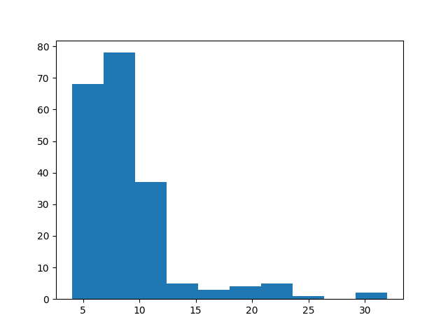

.. _data-linking-details:

Data linking in Citehound
==========================

Data Linking refers to *"the task of finding records in a data set that refer to the same entity across different 
data sources"* [#]_.

Within the context of Citehound, data linking is used to relate (for example) a bibliographic data source's affiliation information 
with the `Research Orgnanisation Registry <https://ror.org/>`_ (previously `GRID <https://grid.ac>`_) [#]_ entities. Specifically, 
taking Pubmed as an example of a bibliographic data source, data linking would attempt to connect an author's affiliation 
(e.g. an institute) with its ROR/GRID identity. 

Entities are linked on the basis of string attributes, making the whole data linking process re-usable. In fact, linking in Citehound 
proceeds in two stages: First link any mention of a country name in an affiliation to the actual country and then link the institutes 
within that country.

This process is handled in a straightforward manner with only a few specific optimisations inserted by Citehound.

Overview of data linking
------------------------

The general framework of data linking is as follows:

Given two sets of entities :math:`U,V` we are trying to establish some relationship :math:`e(u,v)` between 
two entities :math:`u_m,v_n` on the basis of some expression of similarity :math:`g(u_m,v_n)`.

In set builder notation, establishing these relationships is expressed as:

:math:`E = \{(u,v) | u \in U, v \in V, g(u,v) \ge Th\}`

Where :math:`Th` is a threshold value (:math:`Th \in \mathbb{R}`) that is used to convert "soft values" returned 
by the metric :math:`g`, into "hard decisions" (i.e. within the interval :math:`\{0 .. 1\}`.

This definition covers both types of linking, deterministic and probabilistic and hides away their conceptual differences.

.. todo ::
    In deterministic :math:`P_1(u) = P_1(v) \land P_2(u)=P_2(v) \land \ldots`
    
    In probabilistic :math:`f(P_1(u), P_1(v)) \ge Th_{P_1} \land f(P_2(u), P_2(v)) \ge Th_{P_2} \land \ldots`
    
    Katie has wrote about this being similar but in any case, all of this is happening in :math:`g`.
    
This straightforward definition covers a "one-to-one" relationship between **one** element (:math:`u_m`) 
of :math:`U` to **one** element (:math:`v_n`) of :math:`V`.

In Citehound we also had to consider the "one-to-many" relationship where it is necessary to link **one** element (:math:`u_m`) 
of :math:`U` to **many** elements (:math:`v_1,v_2,v_3, \ldots`) and consequently establish more than one relationships.

In Citehound, "entities" are always strings, but where these strings come from is entirely up to the user, making the 
whole data linking process re-usable.

Linking matching string values (one-to-many)
---------------------------------------------

One of the first data linkage processes that was implemented in Citehound was that of matching two sets of strings.

It was implemented first because it addressed one of our use cases directly. We had to match the country and institute 
names that appeared in the affiliation field with those provided by GRID.

An affiliation string is a "very wild animal". 

Here are only some of the forms it can be encountered in:

1. ``Address correspondence to Hannah Zeilig, BA, LCF, University of the Arts, London, 20 John Prince's Street, London W1G 0BJ, UK. E-mail: Hannah.Zeilig@kcl.ac.uk.``
2. ``Authors' affiliations are listed at the end of the article``
3. ``*Division of Brain Sciences, Imperial College London, London, United Kingdom; and Division of Metabolic and Vascular Health, Warwick Medical School, University of Warwick, Coventry, United Kingdom m.sastre@imperial.ac.uk.``
4. ``1] Institute of Psychiatry, King's College London, London, UK. [2].``
5. ``From the Clinical Trial Service Unit and Epidemiological Studies Unit, University of Oxford, Oxford, United Kingdom (R Clarke, DB, SP, SL, JA, JH, and R Collins); the Department of Human Nutrition, University of Otago, Dunedin, New Zealand (MS); the Section for Pharmacology and Department of Public Health and Primary Care, University of Bergen, Bergen, Norway (SJPME); the Department of Epidemiology, School for Public Health and Primary Care, CAPHRI, Maastricht University Medical Centre, Maastricht, Netherlands (SJPME); the Section of Hematology and Coagulation, Department of Internal Medicine, Institute of Medicine, Sahlgrenska Academy at the University of Gothenburg, Gothenburg, Sweden (CL); the Division of Cardiovascular and Medical Science, University of Glasgow, Glasgow, United Kingdom (DJS); the School of Medicine and Pharmacology, The University of Western Australia, Perth, Australia (GJH); the Population Health Research Institute and Department of Medicine, McMaster University, Hamilton, Canada (EL); the Department of Neurology, Western University, London, Canada (JDS); Unité de Recherche en Epidémiologie Nutritonnelle (UREN), Sorbonne-Paris-Cité, UMR Inserm U557, France (PG); Inra U1125, Paris, France (PG); Cnam, Paris, France (PG); Université Paris 13, CRNH IdF, Bobigny, France (PG); the Division of Human Nutrition and Epidemiology, Wageningen University, Wageningen, Netherlands (LCdG); the Department of Nutrition and Public Health Intervention Research, London School of Hygiene and Tropical Medicine, London, United Kingdom (ADD); and the Channing Division of Network Medicine, Department of Medicine, Brigham and Women's Hospital, Boston, MA (FG).``

These strings have to be matched against much more strictly organised and clear lists of universities and countries.

This was addressed by establishing a one-to-many (:math:`1:*`) process with clear semantics.

Following the notation established earlier, it is a function :math:`g_1(U,V, relationshipLabel, sessionID, percRetain, cutOff)` 

Where: 

* :math:`relationshipLabel` is a label that is attached to a given relationship (:math:`e`) and can be used to characterise it
* :math:`sessionID` is a label that is attached to a given relationship (:math:`e`) and denotes the matching process that established it
* :math:`percRetain \in 0..1` is a threshold that trims the comparison sets (please see below)
* :math:`cutOff \in 0..1` is a threshold with semantics that are exactly the same as :math:`Th`.

:math:`g_1` is non-commutative and the side-effects of :math:`g_1(U,V)` (the intended) are different from 
the side-effects of :math:`g_1(V,U)`. This means that the order by which you pass parameters to :math:`g_1()` **matters**.

This is because :math:`g_1` incorporates:

1. A proportional filtering step over :math:`U`
2. An iteration over the remaining elements of :math:'U'
3. A tokenisation of a given :math:`u`
4. A "fuzzy" matching step between a given :math:`u` and :math:`V` before establishing one :math:`e=(u,v_n), n \in \mathbb{N}`

Proportional filtering
----------------------

Proportional filtering is based on the observation that the lengths of strings coming from natural language will follow a non-uniform 
distribution [#]_

For example, the majority of country names have between 4 and 9 letters in their names and very few of them extend all the way up to 30 
characters(fig 1). Examples of the longest country names are ``Democratic Republic of the Congo``, ``Saint Vincent and the Grenadines``.

   Distribution of country name lengths, using the countries referenced by ROR.

    
Consequently, the tokenisation of a given affiliation :math:`u_m` might produce items that are far longer than 4 to 9 characters of the majority 
of country names. 

There is absolutely no reason to burden the evaluation of string similarity with comparison of strings that we **know** are 9 characters long 
with strings that we **know** that are 30 characters long.

Proportional filtering applies a filter on elements of :math:`U, V` that takes into account their distribution of lengths to try and exclude 
impossible matches that are **known** to be poor matches in advance.

Since we are aiming to establish one-to-many relationships, proportional filtering drastically reduces the total ammount of comparisons / operations
that would need to be applied per entry.

"Blocking" and final linking
----------------------------

Citehound's low level generic data linking explained above is applied in two stages on two pairs of entities to produce the final "linking".

At the first stage: Any mention of a country in an author's affiliation is linked to the corresponding Country entity of the ROR dataset.

This information is then exploited to reduce the complexity of the second stage.

Instead of trying to match a given random affiliation sub-string with **all** the known institutes in the ROR dataset, apply "blocking"
by country and compare it only to the subset of institutes within the given country. This is further reduced by proportional filtering 
on institute names of course.

-----

.. Limitations of proportional filtering
.. *************************************
.. 
.. The key limitation of proportional filtering is that its user accepts that a small proportion of :math:`U` elements 
.. will be excluded from comparison and therefore not even get a chance for a link to be established.
.. 
.. For a trivial example, a :math:`percRetain` of :math:`0.9` will exclude ``Democratic Republic of the Congo``. If a publication 
.. does indeed come from that country it would be missed by the matching algorithm.
.. 
.. The positive consequence of this is that it effects a blocking that matches the majority of links. In a second step, the longer 
.. (but far fewer) strings can be retrieved and matched with a :math:`percRetain` of :math:`1.0`. A difficult problem but of lesser extent.
.. 
.. The negative consequence of this is that a given set of strings **to be matched** might indeed contain those elements that will 
.. be excluded by proportional filtering. This however is a corner case. Search results downloaded from pubmed are expected to contain 
.. a random mixture of string lengths.

.. [#] For more information, the `Wikipedia article on Record Linkage <https://en.wikipedia.org/wiki/Record_linkage>`_ is an excellent start.
.. [#] At the time the first draft of this documentation was written, we were using GRID as our institute reference information provider.
       GRID however was superseded in 2015 by the Research Organisation Registry (ROR). The two providers were using a similar (but not identical)
       data schema which was incorporated in Citehound with relatively ease. Consequently however, the GRID and ROR terms are used interchangeably
       in Citehound's documentation.

.. [#] According to `Zipf's Law <https://en.wikipedia.org/wiki/Zipf%27s_law>`_ the distribution of word lengths in the words of a given language is
       following a power law (i.e. there is a very large number of short words but smaller numbers of longer words). But when considering the short 
       extent of strings in an affiliation such a relationship is not expected to be observed reliably. However, the point here is that an affiliation 
       string is not expected to be a completely random assortment of strings (...many real-world affiliations could be classified as such but thankfully 
       these absolute worst case scenarios are rare...ish).

