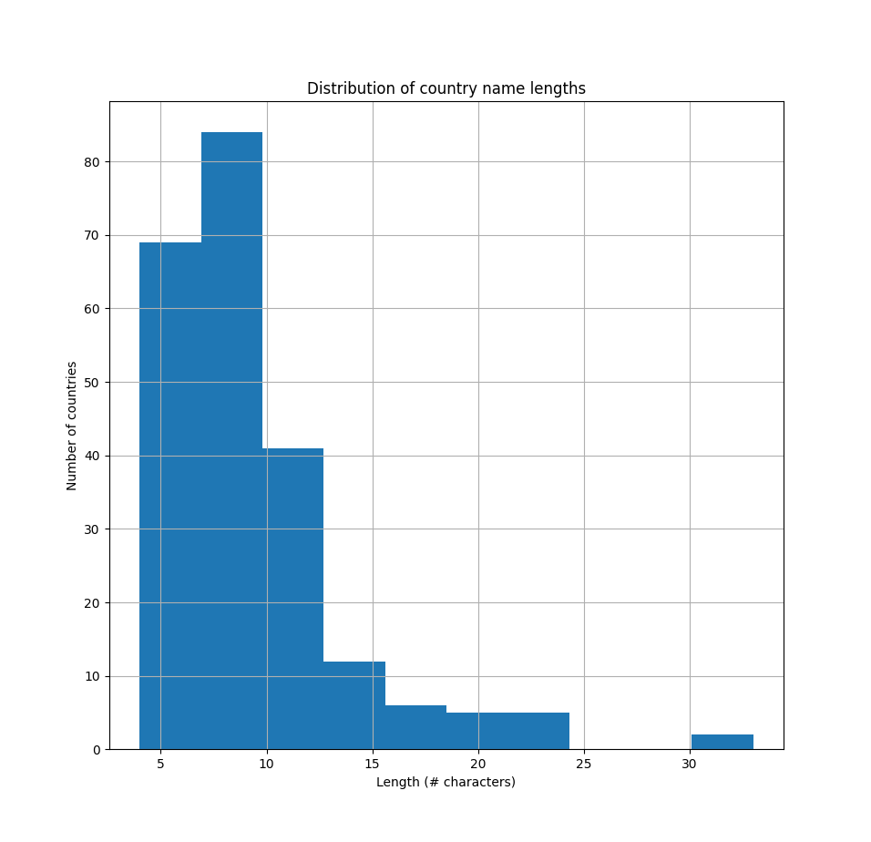
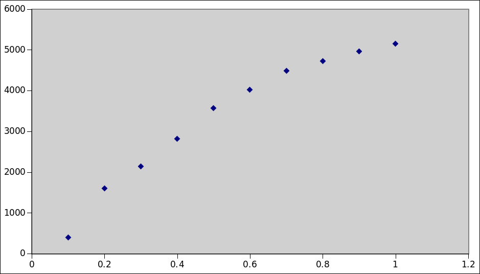
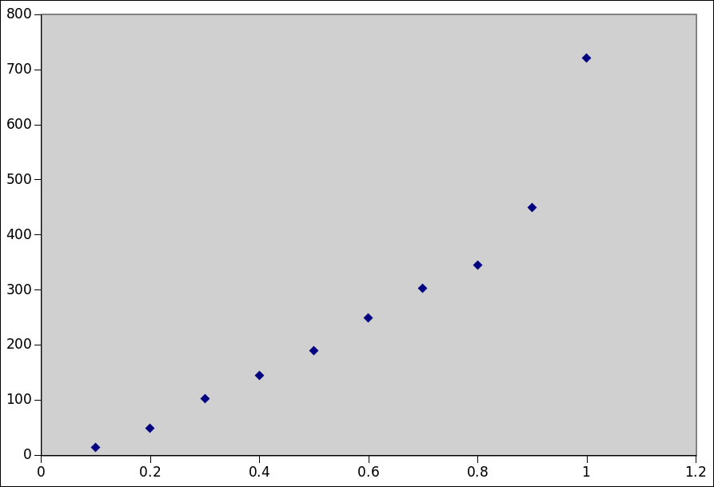

.. _data-linking-details:

Data linking in Citehound
==========================

This section outlines the different modes of data linking and the details behind its 
operation.

The general framework is as follows:

Given two sets of entities :math:`U,V` we are trying to establish some relationship :math:`e(u,v)` between 
two entities :math:`u,v` on the basis of some expression of similarity :math:`g(u,v)`.

Or, in set builder notation:

:math:`E = \{(u,v) | u \in U, v \in V, g(u,v) \ge Th\}`

Where :math:`Th` is a threshold value (:math:`Th \in \mathbb{R}`) that is used to convert "soft values" returned 
by the metric :math:`g`, into "hard decisions" (i.e. within the interval :math:`\{0 .. 1\}`.

This definition encompasses both deterministic and probabilistic linking without demonstrating their conceptual differences.

.. todo ::
    In deterministic :math:`P_1(u) = P_1(v) \land P_2(u)=P_2(v) \land \ldots`
    
    In probabilistic :math:`f(P_1(u), P_1(v)) \ge Th_{P_1} \land f(P_2(u), P_2(v)) \ge Th_{P_2} \land \ldots`
    
    Katie has wrote about this being similar but in any case, all of this is happening in :math:`g`.
    

But semantically, the way this operation is setup, addresses a :math:`1:1` relationship between **one** element (:math:`u`) 
of :math:`U` to **one** element (:math:`v`) of :math:`V`.

In our work we had to also consider the `1:*` relationship where it is necessary to link **one** element (:math:`u`) 
of :math:`U` to **many** elements (:math:`v_1,v_2,v_3, \ldots`) and consequently, each linking step (each production of :math:`e`) 
results in establishing a multitude of relationships.

Linking matching string values (:math:`1:*`)
---------------------------------------------

One of the first data linkage processes that was implemented was that of matching two sets of strings.
It was implemented first because it addressed one of our use cases directly.

In that case we had to match the country and institute names that appeared in the affiliation field with 
those provided by GRID.

An affiliation string is a very wild animal. Here are only some of the forms it can be encountered in:

1. ``Address correspondence to Hannah Zeilig, BA, LCF, University of the Arts, London, 20 John Prince's Street, London W1G 0BJ, UK. E-mail: Hannah.Zeilig@kcl.ac.uk.``
2. ``Authors' affiliations are listed at the end of the article``
3. ``*Division of Brain Sciences, Imperial College London, London, United Kingdom; and Division of Metabolic and Vascular Health, Warwick Medical School, University of Warwick, Coventry, United Kingdom m.sastre@imperial.ac.uk.``
4. ``1] Institute of Psychiatry, King's College London, London, UK. [2].``
5. ``From the Clinical Trial Service Unit and Epidemiological Studies Unit, University of Oxford, Oxford, United Kingdom (R Clarke, DB, SP, SL, JA, JH, and R Collins); the Department of Human Nutrition, University of Otago, Dunedin, New Zealand (MS); the Section for Pharmacology and Department of Public Health and Primary Care, University of Bergen, Bergen, Norway (SJPME); the Department of Epidemiology, School for Public Health and Primary Care, CAPHRI, Maastricht University Medical Centre, Maastricht, Netherlands (SJPME); the Section of Hematology and Coagulation, Department of Internal Medicine, Institute of Medicine, Sahlgrenska Academy at the University of Gothenburg, Gothenburg, Sweden (CL); the Division of Cardiovascular and Medical Science, University of Glasgow, Glasgow, United Kingdom (DJS); the School of Medicine and Pharmacology, The University of Western Australia, Perth, Australia (GJH); the Population Health Research Institute and Department of Medicine, McMaster University, Hamilton, Canada (EL); the Department of Neurology, Western University, London, Canada (JDS); Unité de Recherche en Epidémiologie Nutritonnelle (UREN), Sorbonne-Paris-Cité, UMR Inserm U557, France (PG); Inra U1125, Paris, France (PG); Cnam, Paris, France (PG); Université Paris 13, CRNH IdF, Bobigny, France (PG); the Division of Human Nutrition and Epidemiology, Wageningen University, Wageningen, Netherlands (LCdG); the Department of Nutrition and Public Health Intervention Research, London School of Hygiene and Tropical Medicine, London, United Kingdom (ADD); and the Channing Division of Network Medicine, Department of Medicine, Brigham and Women's Hospital, Boston, MA (FG).``

These strings have to be matched against much more strictly organised and clear lists of universities and countries.

This was addressed by establishing a :math:`1:*` process with clear semantics.

It is a function :math:`g_1(U,V, relationshipLabel, sessionID, percRetain, cutOff)` 

Where: 

* :math:`relationshipLabel` is a label that is attached to a given :math:`e` and can be used to characterise it
* :math:`sessionID` is a label that is attached to a given :math:`e` and denotes the matching process that established it
* :math:`percRetain \in 0..1` is a threshold that trims the comparison sets (please see below)
* :math:`cutOff \in 0..1` is a threshold with semantics that are exactly the same as :math:`Th`.

:math:`g_1` is non-commutative and the side-effects of :math:`g_1(U,V)` (the intended) are different from 
the side-effects of :math:`g_1(V,U)`.

This is because :math:`g_1` incorporates:

1. A proportional filtering step over :math:`U`
2. An iteration over the remaining elements of :math:'U'
3. A tokenisation of a given :math:`u`
4. A "fuzzy" like (almost) matching step between a given :math:`u` and :math:`V` before establishing some :math:`e=(u,v_n), n \in \mathbb{N}`

Proportional filtering
**********************

Proportional filtering is based on the observation that lists of strings coming from natural language will have some sort of distribution
associated with them.

For example, the majority of country names have between 4 and 9 letters in their names and very few of them extend all the way up to 30 
characters(fig 1). Examples of the longest country names are ``Democratic Republic of the Congo``, ``Saint Vincent and the Grenadines``.

    
Consequently, the tokenisation of a given affiliation :math:`u` might produce items that are far longer than 4 to 9 characters of the majority 
of country names. 

There is absolutely no reason to burden the evaluation of string similarity with comparison of strings that we **know** are 9 characters long 
with strings that we **know** that are 30 characters long.

Proportional filtering applies a filter on elements of :math:`u, V` that takes into account their distribution of lengths to try and exclude 
impossible matches that are **known** in advance.

.. todo::
    Explain proportional filtering savings as depicted in the following figures
    

Limitations of proportional filtering
*************************************
There is one limitation of proportional filtering with two different consequences. One positive and one negative.

The key limitation of proportional filtering is that its user accepts that a small proportion of :math:`U` elements 
will be excluded from comparison and therefore not even get a chance for a link to be established.

For a trivial example, a :math:`percRetain` of :math:`0.9` will exclude ``Democratic Republic of the Congo``. If a publication 
does indeed come from that country it would be missed by the matching algorithm.

The positive consequence of this is that it effects a blocking that matches the majority of links. In a second step, the longer 
(but far fewer) strings can be retrieved and matched with a :math:`percRetain` of :math:`1.0`. A difficult problem but of lesser extent.

The negative consequence of this is that a given set of strings **to be matched** might indeed contain those elements that will 
be excluded by proportional filtering. This however is a corner case. Search results downloaded from pubmed are expected to contain 
a random mixture of string lengths.

.. note::
    Maybe you can tokenize the RIGHT, blindingly and then take the distribution of that (without knowing what is actually contained in 
    the strings (whether country or institute)) and use it as an indication on determining :math:`percRetain`
