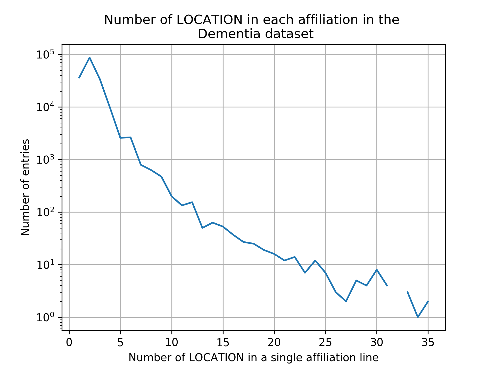
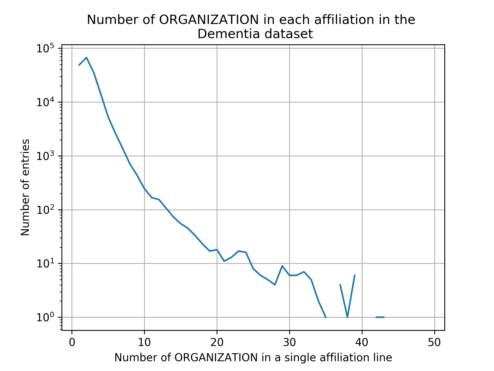
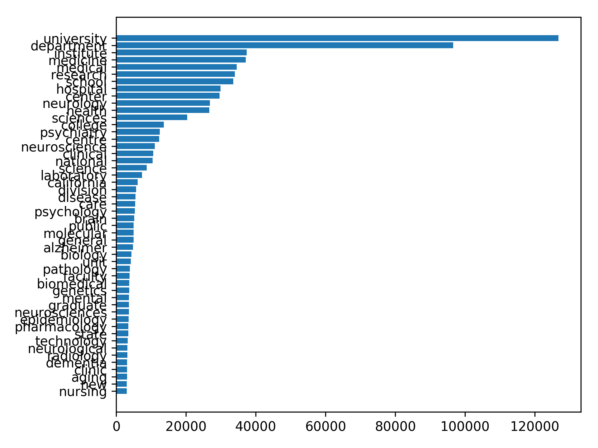

Deduplication of institution names
==================================

This internal report is outlining the method and results of a first attempt 
at de-duplicating institution names from pubmed results.

The deduplication is an extremely complicated task and a large ammount of 
this complexity is due to the way the data is captured by publishers.

Best results were obtained via the `Stanford Named Entity Recogniser (NER) <https://nlp.stanford.edu/software/CRF-NER.shtml>`_
which is an integral part of the de-duplication. Unforunately, NER is only 
the first step in this process which needs further steps to be optimised.

Materials & Methods
-------------------

Data
****

* Perform Advanced search on `Pubmed <https://www.ncbi.nlm.nih.gov/pubmed/>`_ for 'dementia'
* Download data in XML
* Import XML into bibInsight ``IMPORT PUBMED FROM 'file://localhost/../data/pubmed_result.xml' AS dementia USING {'dbConURI':'mongodb://localhost:27017', 'dropFirst':True, 'insertEvery':20000, 'db':'test'};``
* Extract list of affiliations with ``createHelperStructures.js`` from ``src/queries/mongodb``
* Save that list of affiliations to a text file (here ``test.txt``)

This saves each author's affiliation to a text file with one affiliation 
per line.

*Affiliation* here is a floating concept. This is the affiliation of an author 
in the context of a specific paper and **in no case it should be assumed that 
there is a 1:1 correspondence between ONE author and their organisation**.

In the context of a specific paper:

* ONE author might have been assigned with ONE institution
* ONE author might have been assigned to TWO institutions
* ONE OR MORE authors may have been assigned to the same Insitution

At this point, the data can run through the ``try_dedup.py`` script which 
produces the final results.

dedup_NER.py
************

The key idea behind this script is to de-duplicate the names of the affiliated 
institutions to reduce duplicates because of the different ways that the same 
institution may have been represented in a text file.

The core idea is to group together strings that share a high degree of 
similarity.

This is a tough problem because, given a set :math:`S` of affiliations, all 
:math:`S \times S` pairs of similarities would have to be estimated **BEFORE** 
thresholding is applied to group together those that are similar / identical.

This cartesian product poses a limit on computation incredibly fast. To avoid it, 
one must first apply **blocking**.

In this particular case, blocking was applied to the level of the country. Therefore, the 
complete algorithm is:

* Perform Entity Extraction to determine which tokens are organisations, names, locations etc
* Group all entries from the same location (therefore now forming individual :math:`s_{country} \in S` the size of which can be more manageable)
* For each individual country, de-duplicate the institution names.

``dedup_NER.py`` produces ``pickledTags.bin`` which is a pickled list of 
all results from the NER process.

dedup_main.py
*************
The main deduplication step

Results
-------

How many affiliations can be found associated with one or more authors?

   
   Number of LOCATION tags per affiliation from the dementia dataset, please note 
   the y-axis is logarithmic.
   
   

   
   Number of ORGANISATION tags per affiliation from the dementia dataset, please note 
   the y-axis is logarithmic.
   

   
   Number of LOCATION tags per affiliation from the dementia dataset, please note 
   the y-axis is logarithmic.
