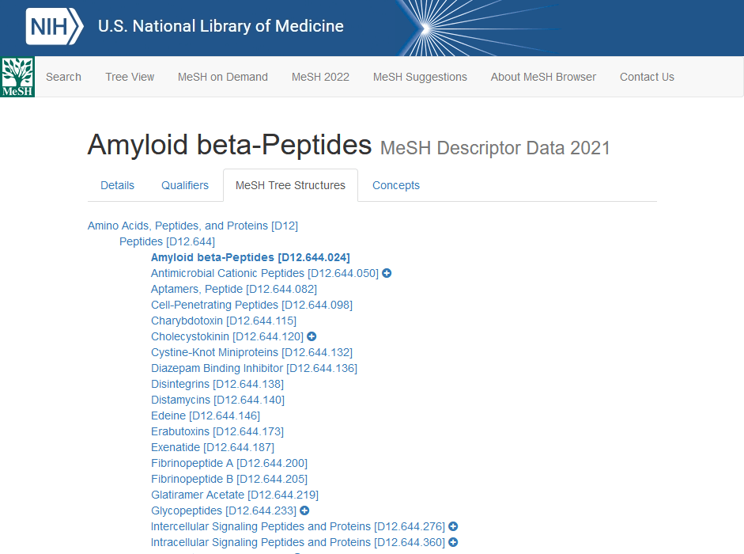

==========
Motivation
==========

The primary motivation for putting together Citehound was the sheer amount of repetitive 
tasks we found ourselves having to do while trying to process bibliographical data.

Why analyse bibliographical data?
=================================

.. todo::
    Motivation for bib data analysis in general

Starting from scratch
=====================

There is no better demonstrator of the motivating factors behind Citehound than reviewing 
a small snippet of all the attributes that are associated with an academic paper in the 
Pubmed data base.

.. literalinclude:: resources/code_examples/pubmed_sample_full.xml

The most natural reaction to anyone who may have browsed a Pubmed XML file with a view to analysing its contents, is to go:

*"Alright, let's write a script to extract the data we are after".*

There is absolutely no doubt that simple Python programs can be written to parse and extract some parameters of interest out of these data and analyse it.

The "fun" bit starts when those first simple things have showed their potential and now 
as investigators we start asking for more parameters, more inference, more accuracy and 
so on. Suddenly, that XML Python script with the 72 ad-hoc additions it suffered on its 
way to publishing that one "proof-of-concept" paper shows its limitations.

Even existing tools leave a lot of work up to the researcher especially when it comes to pre-processing and data linkage.

.. _ref_importing_mesh_background:

Background to the MeSH hierarchy
--------------------------------
Every Pubmed academic journal article entry has one or more subject descriptors associated with it, describing
the topic(s) that a given paper is dealing with. Here is an extract from an academic journal entry to show what these
descriptors look like:

.. literalinclude:: resources/code_examples/pubmed_sample_mesh.xml
       :language: xml

Each one of these descriptor "codes" (e.g. ``D000544``) points to a fully documented term in the MeSH hierarchy.

There is tremendous value in these descriptors because they are assigned by human beings and because
the descriptors themselves form a hierarchy. Here is what this hierarchy looks like from the MeSH browser:

.. _label_fig_mesh_peptides_example_opt:

       A branch of the MeSH tree showing the hierarchical organisation of the subject descriptors.

The motivation for including the ability to actively use these descriptors for querying data within Citehound is
the ability to form queries that can collect articles from "subject generalisations" by following the branches
of the MeSH tree to higher levels.

For example, given the "Aminoacids, Peptides and Proteins" branch of the MeSH tree depicted in
figure :numref:`label_fig_mesh_peptides_example_opt`, it is extremely straightforward to recall all papers that
have a particular descriptor attached to them. You just search for all articles that include the ``D016229`` descriptor.

But with the availability of the hierarchy, given a descriptor it is possible to retrieve the MeSH hierarchy "tree
location identifier", use that identifier to move up the hierarchy a level (to the more general subject), retrieve
the descriptors that describe the general subject and finally all of the papers that are in the same general subject as
a given paper.

Having access to the complete hierarchy might seem like an overkill, given that the tree identifier is self-describing.
That is, given ``D12.644.024``, it is already known that ``024`` is a specialisation of the ``644`` which is a
specialisation of the ``D12`` branch.

But, this is not the whole story. The same MeSH descriptor can belong to two branches of the MeSH tree but, more
importantly, the MeSH hierarchy is a *dynamic network*.

This changes everything.

Over time, new codes come into existence and older codes are withdrawn or, worse even, get merged or re-assigned. For
example, the term `Blockchain <https://meshb-prev.nlm.nih.gov/record/ui?ui=D000081186>`_ was only established in 2019
and if you try to search for ``D003293`` (also known as "Convulsions") in the 2021 version of the MeSH tree, you
`will not find that code <https://meshb-prev.nlm.nih.gov/search?searchInField=ui&searchType=exactMatch&searchMethod=SubString&q=D013135>`_.
And yet, ``D003293`` was being assigned to papers between the years of 2002 and 2004 when the tree was re-organised.

What this means is that if your search covers a long enough span (e.g. 3-5 years), your static search queries, simply
referencing a code, will be inaccurate.

How do we know?

In our research we came across this type of "problems" with codes very often, especially when trying to be very
specific (e.g. in rare diseases). It was already expected that a given query would return just a few results but
trying to expand this search with alternatives was now inhibited by the fact that the MeSH hierarchy was changing
throughout the time span that a given search was covering.

To counter-act this we needed to know how does the MeSH tree was changing over time. That is, which year a new code
was introduced, which year it was removed, which year it was modified (and how) and so on.

This is why the actual data importing process detailed further below, is split into two parts.

